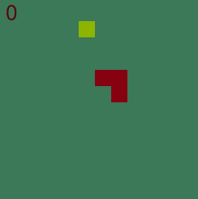
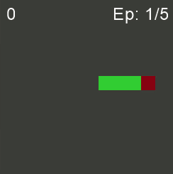

# 🐍 Snake IA: De Q-Learning a Deep Q-Learning

[]()
[]()


> Un día me aburría y entrené una IA... ¡Y la cosa se puso interesante! Aquí explico la experiencia.

<table>
  <tr>
    <td align="center">Q-Learning</td>
    <td align="center">Deep Q-Learning</td>
  </tr>
  <tr>
    <td></td>
    <td></td>
  </tr>
</table>

## Contenido

- [🐍 Snake IA: De Q-Learning a Deep Q-Learning](#-snake-ia-de-q-learning-a-deep-q-learning)
  - [Contenido](#contenido)
  - [El Proyecto](#el-proyecto)
  - [¿En qué consiste esta práctica? (para dummies)](#en-qué-consiste-esta-práctica-para-dummies)
  - [Evolución, Experiencia y Observaciones](#evolución-experiencia-y-observaciones)
    - [Q-Learning Clásico ("La Chuleta")](#q-learning-clásico-la-chuleta)
    - [Deep Q-Learning ("El Cerebro Artificial" y sus Versiones)](#deep-q-learning-el-cerebro-artificial-y-sus-versiones)
    - [Resumen Comparativo de Versiones](#resumen-comparativo-de-versiones)
  - [Reflexiones y Futuros Pasos](#reflexiones-y-futuros-pasos)
  - [Cómo Probar los Agentes](#cómo-probar-los-agentes)
    - [Requisitos previos](#requisitos-previos)
    - [Instalación](#instalación)

## El Proyecto

Este proyecto nació de la curiosidad y el desafío personal de entrenar una Inteligencia Artificial para dominar el clásico juego de Snake. A lo largo de este viaje, he explorado, comparado y evolucionado diferentes enfoques del aprendizaje por refuerzo:

1.  **Primer Intento: Aprendizaje con una "Chuleta" (Q-Learning Clásico)**
2.  **Iteraciones con un "Cerebro" para la Serpiente (Deep Q-Learning con Redes Neuronales)**: Esta fase ha tenido múltiples versiones, cada una construyendo sobre la anterior.

El objetivo final es observar la evolución del aprendizaje, las limitaciones de cada método, los desafíos técnicos y, por supuesto, ¡ver hasta dónde puede llegar cada IA!

## ¿En qué consiste esta práctica? (para dummies)

Imagina que queremos enseñarle a una serpiente digital a jugar al Snake.

1.  **El Método de la "Chuleta" (Q-Learning Clásico)**:
    * Al principio, es como si le diéramos a la serpiente una enorme hoja de trucos. Por cada situación posible en el juego (dónde está la comida, dónde están los obstáculos, etc.), la IA anota qué tan buena o mala es cada posible acción (moverse arriba, abajo, izquierda o derecha).
    * Fui ajustando cómo la IA "veía" el tablero y qué consideraba un "premio" (comer la fruta) o un "castigo" (chocar). También le enseñé a reconocer peligros básicos.
    * Aunque la serpiente aprendió bastante, llegó un punto en que no mejoraba más. Se quedaba atascada en sus propios enredos. La "chuleta" se volvía demasiado grande e inmanejable para todas las sutilezas del juego.

2.  **El Método del "Cerebro Artificial" (Deep Q-Learning con Redes Neuronales)**:
    * Como la "chuleta" no fue suficiente, decidí darle a la serpiente un "cerebro" artificial. Este cerebro usa redes neuronales (con TensorFlow) y es capaz de aprender patrones complejos y tomar decisiones más inteligentes, incluso en situaciones no vistas idénticamente antes.
    * Este "cerebro" aprende jugando muchísimas partidas. Para optimizar su aprendizaje, he implementado y refinado varias técnicas a lo largo de diferentes versiones:
        * **Memoria de Experiencias (Replay Memory)**: Guarda lo que hizo y qué pasó después, para repasar y aprender de aciertos y errores.
        * **Red Neuronal Objetivo (Target Network)**: Una "copia de seguridad" de la red principal que se actualiza más despacio, ayudando a estabilizar el aprendizaje.
        * **Entrenamiento "Headless"**: Reorganicé el código para entrenar la IA sin necesidad de verla jugar (mucho más rápido) y desarrollé interfaces separadas para visualización (gráfica con Arcade y en modo texto con `curses`).

## Evolución, Experiencia y Observaciones

### Q-Learning Clásico ("La Chuleta")

* **Desafíos Iniciales**: Ajustar la exploración fue clave; demasiada aleatoriedad limitaba el progreso.
* **Entrenamiento y Rendimiento**: A los 10,000 episodios la IA se estancó asi que decidí hacer un ciclo más largo de 200,000 episodios (aprox. 4 horas), pero la mejora fue apenas significativa, alcanzado una **puntuación media de 21~22 puntos**, con picos ocasionales cercanos a 40. 
* **El Gran Límite**: La incapacidad para resolver eficazmente el problema de **quedar encerrado en sí mismo** fue su principal talón de Aquiles. La planificación a largo plazo era demasiado compleja para la tabla Q.
* **Conclusión sobre Q-Learning**: Aunque Snake parece simple, requiere una estrategia considerable. Q-Learning, al memorizar estados, no es ideal para esta complejidad, lo que motivó la transición a redes neuronales.

### Deep Q-Learning ("El Cerebro Artificial" y sus Versiones)

El camino con Deep Q-Learning ha sido un proceso iterativo de experimentación, optimización y aprendizaje, tanto para la IA como para mí.

* **Retos Técnicos Iniciales (Comunes a varias versiones)**:
    * **Configuración de TensorFlow y GPU**: Entrenar con CPU ocupaba muchos recursos, entre 90 y 99%. La solución más efectiva fue usar contenedores Docker con entornos TensorFlow-GPU preconfigurados por Nvidia, reduciendo significativamente el consumo de la CPU a un 15-20%.
    * **Entrenamiento Headless y Múltiples Interfaces**: La necesidad de entrenar en entornos sin gráficos (como Docker) llevó a refactorizar el código para separar la lógica del juego de la UI. Esto permitió un entrenamiento eficiente y la creación de interfaces con Arcade (gráfica) y `curses` (terminal).

* **Hitos y Aprendizajes por Versión (Resumen)**:

    * **Versión Inicial a v4**: Primeras implementaciones del DQN, ajustes básicos de hiperparámetros, y solución de los retos técnicos de GPU y entrenamiento headless. Se observó potencial, pero el rendimiento aún era errático.

    * **Versión 5 ("Optimizaciones y Paralelismo")**:
        * Se introdujo **Numba**, un compilador Just-In-Time (JIT) para Python, que traduce funciones de Python y NumPy a código máquina optimizado. Se aplicó para acelerar cálculos críticos como la detección de colisiones.
        * Se experimentó con el módulo `multiprocessing` de Python para intentar paralelizar partes del entrenamiento y aprovechar múltiples núcleos de la CPU. Sin embargo, la complejidad añadida no se tradujo en una mejora clara del rendimiento para este caso de uso específico y se descartó para simplificar.

    * **Versión 6 ("Explorando Nuevos Estados")**:
        * Se probó añadir una nueva característica al estado del agente: la "Accesibilidad de la Cola Después de Comer". La idea era darle a la serpiente información sobre si, después de comer una fruta, su propia cola bloquearía un camino vital.
        * Este experimento resultó ser **contraproducente**. Añadir esta información, que además requería cálculos adicionales (como un BFS), pareció confundir al agente o añadir ruido al estado, llevando a peores resultados de aprendizaje. Fue una lección valiosa sobre cómo más información no siempre es mejor.

    * **Versión 7 ("Alineación con Investigación y Mejoras Drásticas")**:
        * Se realizó una investigación más profunda de implementaciones de Snake IA existentes y *papers* académicos (como el de Sourena Khanzadeh) para comparar arquitecturas y parámetros.
        * **Cambios Clave Inspirados en la Investigación**:
            * Se **redujo el espacio de estados de 12 (en v6) de nuevo a 11 parámetros booleanos simples**, eliminando la "accesibilidad de la cola" y otros estados complejos, para coincidir con configuraciones probadas.
            * Se **cambió el tamaño del tablero de 12x12 a 20x20**, proporcionando un entorno de aprendizaje más extenso y comparable al del informe de referencia.
            * Se ajustó el **decaimiento de épsilon de multiplicativo a lineal**, permitiendo una fase de exploración más controlada y prolongada.
            * Se refinaron otros hiperparámetros (gamma, batch size, frecuencia de actualización de la red objetivo) para alinearlos con las mejores prácticas observadas.
        * **Resultados**: Estos ajustes produjeron una **mejora muy significativa**. El agente comenzó a mostrar un aprendizaje mucho más rápido y eficiente. Por ejemplo, tras unos 1000 episodios de entrenamiento en esta configuración, el agente ya alcanzaba una **puntuación media de alrededor de 23-24 puntos**, una mejora drástica en comparación con las decenas de miles que se necesitaban antes para progresos menores o con Q-Learning para conseguir los mismos resultados.

* **Evolución General del Aprendizaje (con DQN v7 y posteriores refinamientos)**:
    * El agente DQN, especialmente a partir de la v7, muestra un rendimiento muy prometedor. Aunque el número total de episodios de entrenamiento aún puede ser menor que el del Q-Learning en algunas comparativas, la **eficiencia (puntuación/episodio) y la tendencia ascendente son claramente superiores**.
    * El aprendizaje sigue un patrón de "dientes de sierra": ciclos de mejora, seguidos de mesetas donde parece consolidar lo aprendido, para luego volver a escalar.
    * El principal desafío sigue siendo perfeccionar las estrategias para evitar auto-colisiones complejas a largo plazo, pero la base actual es mucho más sólida.

### Resumen Comparativo de Versiones

| Versión   | Puntuación | Episodios | Comentarios                                         |
|-----------|------------|-----------|-----------------------------------------------------|
| QL v1     | ~20        | 10,000    | A partir de aquí se estanca                          |
| QL v2     | ~20        | 10,000    | Separación de colisión en dos partes, poca mejora  |
| DQN v4    | ~20        | 10,000    | Diferentes ajustes básicos, rendimiento errático   |
| DQN v5    | ~20        | 10,000    | Optimización con Numba y pruebas de paralelismo    |
| DQN v6    | ~10        | 10,000    | Se añade un 12º parámetro; resultado contraproducente |
| DQN v7    | ~24        | 1,000     | Vuelta a 11 parámetros y optimización inspirada en papers |
| DQN v8    | ~28        | 1,000     | Ajuste del min epsilon, recompensas e hiperparámetros |
| DDQN v9   | ~28        | 300       | Implementación algoritmo Double DQN, mismos ajustes  |

> Las puntuaciones pueden variar entre ejecuciones, estas cifras representan tendencias generales observadas.

## Reflexiones y Futuros Pasos 

Este proyecto, aunque ha avanzado considerablemente, abre la puerta a numerosas exploraciones y plantea preguntas interesantes sobre los límites y la filosofía del entrenamiento de IA a nivel individual.

* **Limitaciones de Recursos y Escala**:
    * Alcanzar el rendimiento de modelos entrenados a gran escala (con millones o miles de millones de interacciones, como se ve en investigaciones con grandes recursos computacionales) es un desafío enorme para proyectos personales. La disponibilidad de GPUs potentes y el tiempo de entrenamiento son factores limitantes.
    * Si bien la optimización del código (como el uso de Numba o la mejora de la eficiencia de TensorFlow) ayuda, la cantidad bruta de "experiencia" (episodios jugados) sigue siendo un factor dominante en el aprendizaje por refuerzo profundo.

* **¿Más Optimización vs. "Pureza" del Aprendizaje?**:
    * **Ingeniería de Recompensas Adicional (Reward Shaping)**: Se podría experimentar con recompensas más gradadas (ej., pequeñas recompensas por acercarse a la comida, penalizaciones por acercarse a las paredes antes de una colisión inminente). Sin embargo, como se observó en la investigación de referencia y en la literatura de RL, esto es un arma de doble filo. Puede guiar el aprendizaje, pero también puede llevar a que la IA "piratee" el sistema de recompensas, aprendiendo comportamientos subóptimos que maximizan estas recompensas intermedias en lugar del objetivo real (sobrevivir y comer).
    * **Incorporación de Conocimiento Explícito (Heurísticas o Patrones)**: ¿Sería beneficioso "enseñarle" a la IA patrones de movimiento conocidos como estrategias de zig-zag o "box patterns" para llenar el espacio de forma segura?
        * **Argumento a favor**: Podría acelerar el aprendizaje de estrategias de supervivencia a largo plazo y alcanzar puntuaciones más altas más rápidamente.
        * **Argumento en contra (la "pureza")**: El objetivo fundamental del aprendizaje por refuerzo es que el agente descubra estas estrategias por sí mismo a partir de la interacción con el entorno y las recompensas. Introducir heurísticas podría considerarse "hacer trampa" o limitar la capacidad del agente para encontrar soluciones novedosas o incluso superiores que un humano no habría diseñado.
    * **El Equilibrio**: La filosofía adoptada hasta ahora ha sido proporcionar al agente la información de estado necesaria y un sistema de recompensas claro, permitiéndole derivar la política de acción por sí mismo. Este enfoque busca un aprendizaje más general y autónomo.

* **Posibles Líneas de Trabajo Futuras (si los recursos y el tiempo lo permiten)**:
    * **Entrenamiento Extensivo**: Continuar el entrenamiento del agente DQN v7 (o versiones posteriores) durante un número mucho mayor de episodios (decenas de miles o cientos, si es factible) para ver hasta dónde puede llegar su rendimiento con la configuración actual.
    * **Ajuste Fino de Hiperparámetros**: Realizar una búsqueda más sistemática de hiperparámetros (tasa de aprendizaje, arquitectura de la red, parámetros de decaimiento de épsilon, tamaño de la memoria de repetición) podría exprimir un rendimiento adicional.
    * **Algoritmos de RL Más Avanzados**: Explorar otros algoritmos de Deep RL como Dueling DQN, Double DQN, A2C/A3C, o PPO, que han demostrado mejoras en otros dominios.
    * **Análisis Profundo del Comportamiento**: Utilizar herramientas de visualización de activaciones de la red o mapas de prominencia (saliency maps) para intentar comprender mejor qué está "pensando" la IA y por qué toma ciertas decisiones, especialmente en situaciones complejas.

Este proyecto subraya que, incluso en un juego aparentemente simple como Snake, los desafíos del aprendizaje por refuerzo profundo son considerables y ofrecen un terreno fértil para la experimentación y la reflexión continua.

## Cómo Probar los Agentes

Asegúrate de tener Python 3.11 o superior (o ajusta la versión en `Pipfile`).

### Requisitos previos

- Python 3.11+
- Pipenv (`pip install pipenv`)
- **Recomendado para entrenar DQN**:
  - NVIDIA GPU con drivers actualizados
  - CUDA Toolkit 11.8
  - cuDNN 8.6

### Instalación

1.  **Clonar el repositorio (si aún no lo has hecho):**
    ```bash
    git clone https://github.com/hcosta/snake-ia.git
    cd snake-ia
    ```

2.  **Instalar las dependencias usando Pipenv (en el directorio principal):**
    ```bash
    pipenv install
    ```

3.  **Ejecutar el Agente Q-Learning (Ejemplo):**
    ```bash
    cd snake-QL
    pipenv run python trainer_v2.py --play --play-speed=0.02 
    ```

4.  **Entrenar el Agente Q-Learning (Ejemplo):**
    ```bash
    cd snake-QL
    pipenv run python trainer_v2.py --no-visualize --reset --episodes=10000
    ```

5.  **Ejecutar el Agente DQN (Versión 7 o la más reciente):**
    ```bash
    cd snake-DQN
    pipenv run python trainer_v7.py --play --play-speed=0.02
    ```

6.  **Entrenar el Agente DQN (Versión 7 o la más reciente):**
    ```bash
    cd snake-DQN
    pipenv run python trainer_v7.py --episodes=1000 --reset
    ```

7.  **Jugar al Snake Manualmente (sin IA):**
    * **Versión Gráfica (Arcade):**
    ```bash
    cd snake-DQN
    pipenv run python snake_ui_v10.py
    ```
    * **Versión en Terminal (Curses):**
    ```bash
    cd snake-DQN
    pipenv run python snake_shell_v10.py
    ```